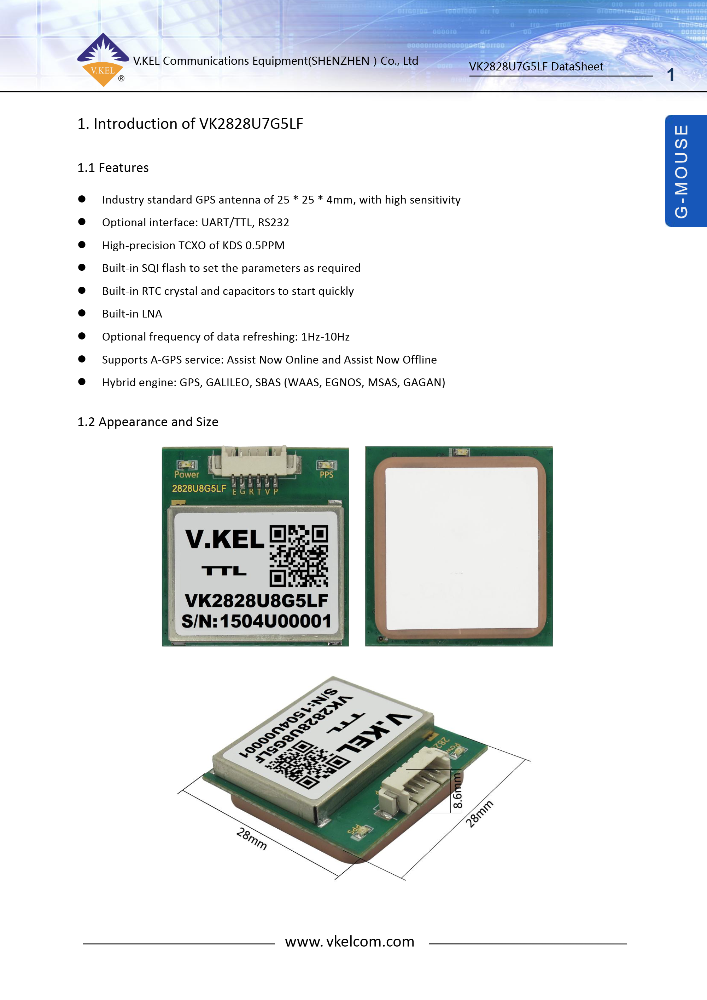
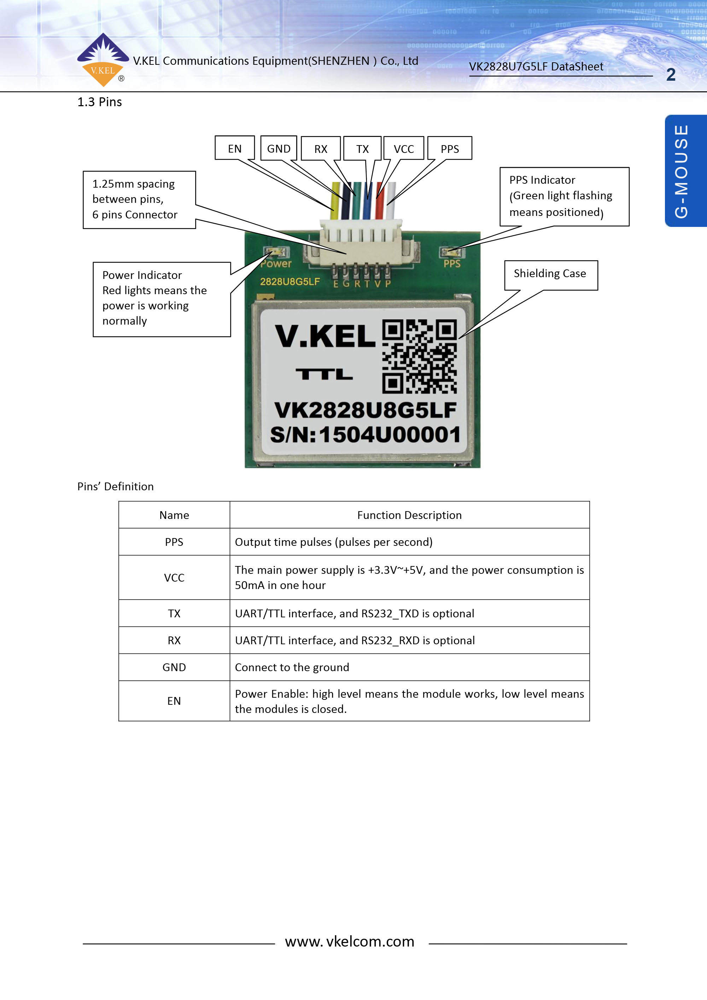

.. _VK2828U7G5LF:
[copywiki destination="plane,copter,rover,blimp,sub"]
======================
K-KEL-GPS/VK2828U7G5LF
======================
Features
========
* Industry standard GPS antenna of 25 * 25 * 4mm, with high sensitivity
* Optional interface: UART/TTL, RS232
* High-precision SQI flash to set the parametrs as required
* Built-in SQI flash to set the parameters as required
* Built-in RTC crystal and capacitor to start quickly
* built-in LNA
* Optional frequency od data refreshing: 1Hz-10Hz
* Suports A-GPS service: Assist Now Online and Assist Now Offline
* Hybrid engine: GPS, GALILEO, SBAS (WAAS, EGNOS, NSAS, GAGAN)

Appearance and size
========

.. image:: imagens/03.png
   :target: /imagens/03.png

Pins Definition
========
* PPS - Output time pulses (pulses per second)
* VCC - The main power supply is +3.3V~+5V, and the power consumption is 50mA in one hour
* TX - UART/TTL interface, and RS232_TXD is optional
* RX - UART/TTL interface, and RS232_RXD is optional
* GND - Connected to the ground
* EN -  Power Enable: high level means the module works, low leval means the module is closed.

